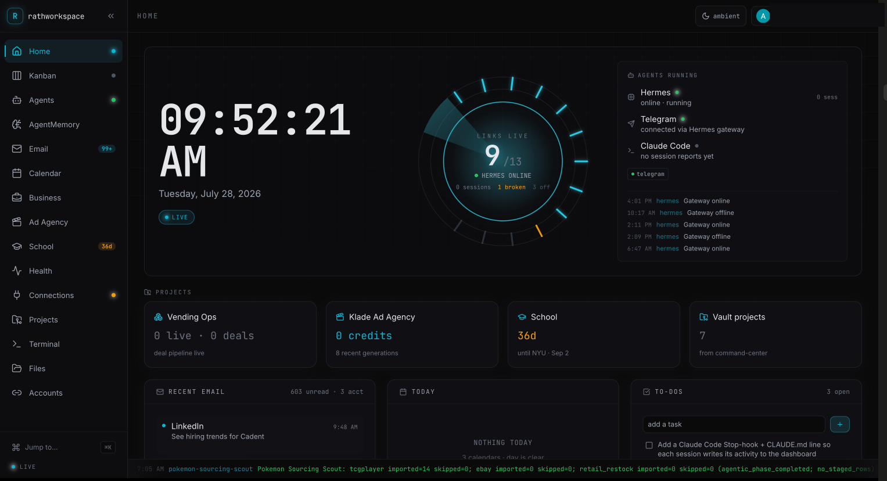
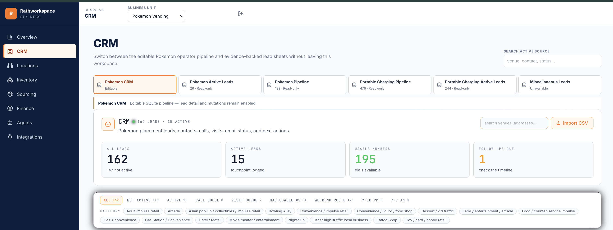
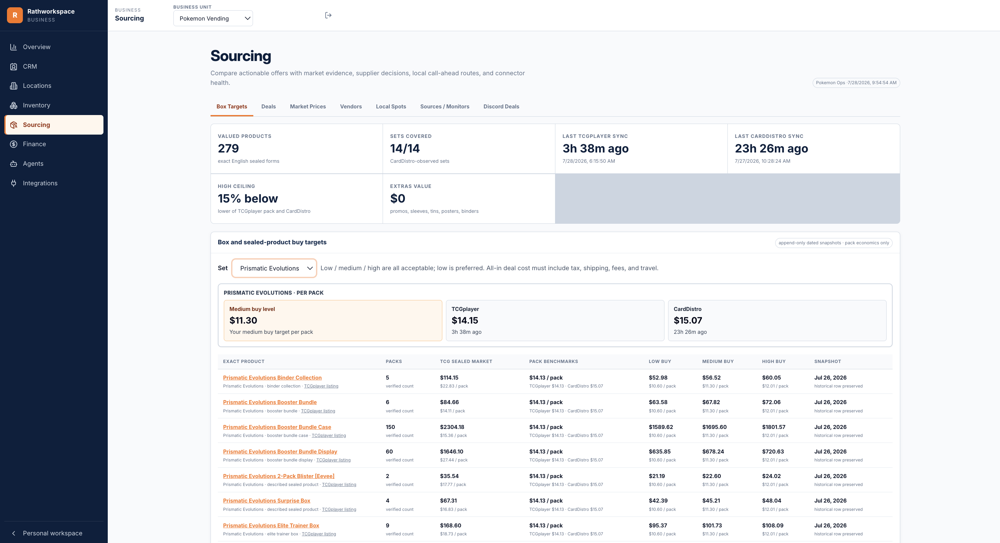
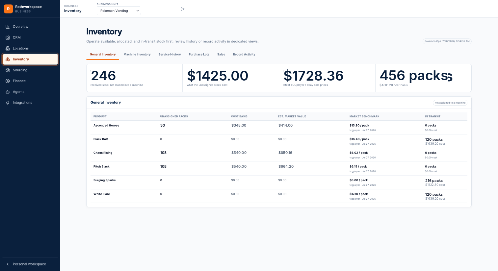
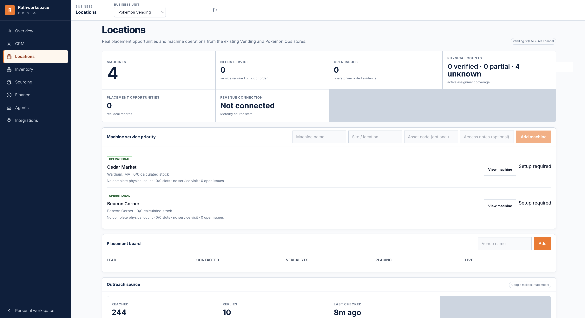
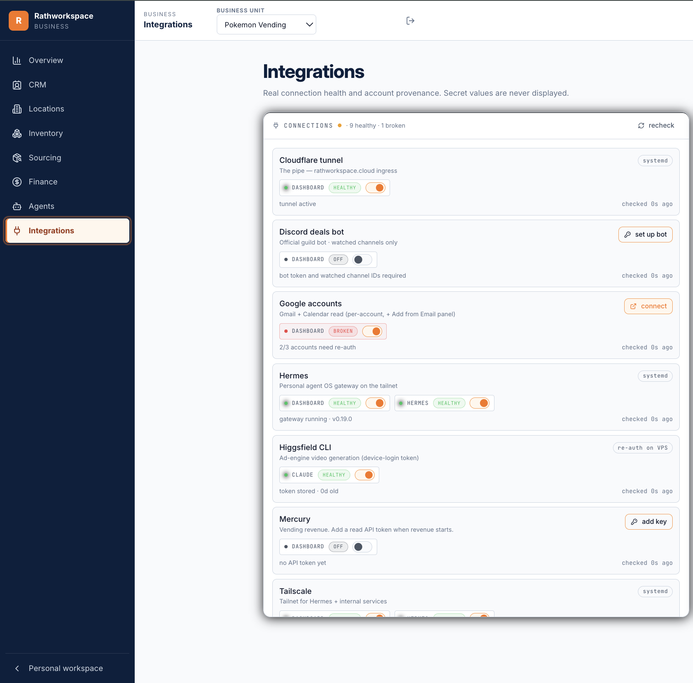
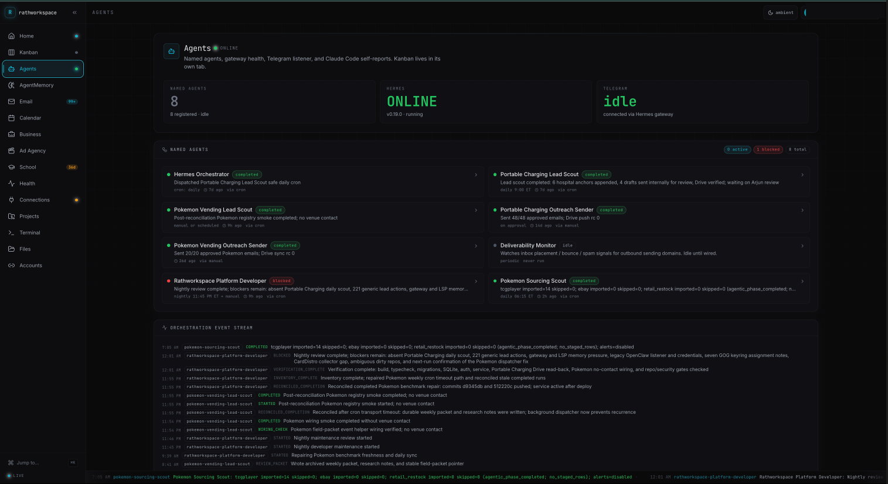
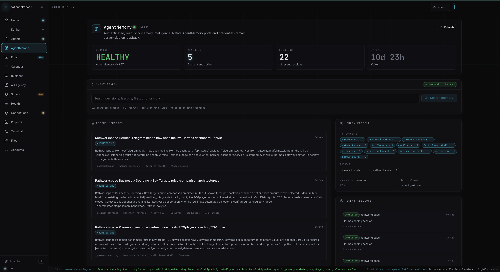
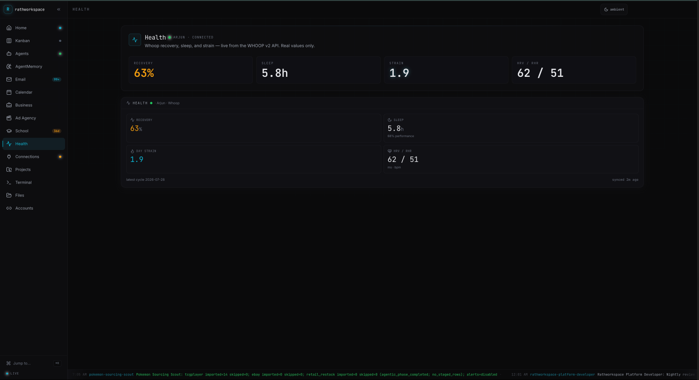
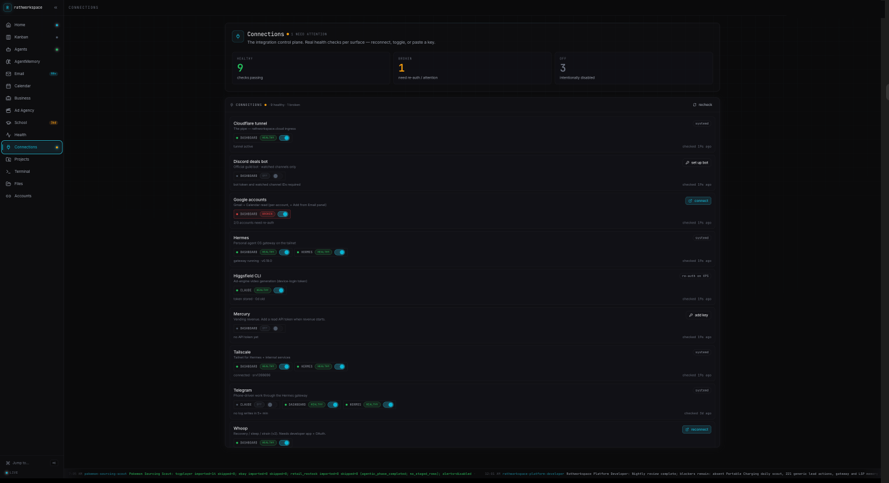

# LIFE-OS

A personal life OS and a business operating system living in one gated web app, run by an
agent harness on a single VPS. One Next.js server, two distinct UIs (a life dashboard and a
business management suite), one SQLite database, and a set of named agents that do scheduled
work, report every run back into the app, and are supervised from a phone.

It is not a dashboard template. The business suite is the system a real vending operation is
run from: leads, calls, placements, machine service visits, physical inventory counts,
sourcing decisions against live market prices. The agent layer is not a chat window bolted on
the side. Agents are the thing that runs on a schedule, and the dashboard is the control tower
that shows what they did.


*Home: live agents, connection ring, calendar, email feed, and project glance on one screen.*

Screenshots come from the running system. Operational values in some of them (venue names,
machine counts, inventory quantities, dollar figures) are deliberately fictionalized. No real
customer, supplier, or revenue data appears anywhere in this repo.

---

## 1. Business management suite

A second shell at `/business` with its own navigation and a business-unit switcher. It shares
the app, the auth gate, the database, and the WebSocket with the life dashboard, but nothing
else. Units that have no real integration render an explicit empty state rather than showing
relabeled data from another unit, which is a deliberate boundary in
`components/business/BusinessContext.tsx`.

### CRM


*CRM: editable pipeline, evidence-backed lead sheets, and queue filters.*

One editable pipeline backed by SQLite, plus read-only lead sheets mounted from CSV exports and
a spreadsheet, all in one tabbed workspace so the operator never leaves to check a source.

The data model (`db/migrations/0009_pokemon_crm.sql`) treats a lead as a venue with many
contacts, many phone numbers, and many emails. Phone numbers are first-class rows, never
deleted, each carrying its own outcome (`reached_owner`, `no_answer`, `wrong_person`,
`dnc`, `bad`). That matters because the expensive knowledge in cold outreach is which of five
numbers actually reaches the decision maker, and a CRM that overwrites a phone field destroys
exactly that.

The core invariant: leads start inactive, and the first logged call, visit, or email flips
them active permanently. Activity is the only thing that promotes a lead, so the active queue
cannot be inflated by editing a status field.

Ingestion is two importers plus manual entry:

- A contact-export importer (`scripts/import-pokemon-crm.ts`) that parses a multi-contact
  cell format into normalized contact and phone rows.
- A pipeline importer (`scripts/import-pokemon-pipeline-crm.ts`) that the lead-scout agent's
  worker calls after each run. It is idempotent via fingerprint receipts
  (`db/migrations/0010_pokemon_pipeline_sink_receipts.sql`), so a re-run of a partially failed
  sync does not duplicate leads.

Leads are scored on two axes before a human ever looks at them (`lib/pokemon-fit.ts`): fit for
the product, and how reachable the actual owner is. A venue that is a perfect fit but only has
a corporate switchboard ranks below a worse-fit venue where the owner answers the phone.

### Sourcing and pricing


*Sourcing: buy targets per set benchmarked against live market and wholesale quotes.*

The question this answers: someone offers a lot of product at a price, and it needs a buy or
pass decision in the time it takes to reply to a message.

A daily job refreshes market prices for every tracked product into an append-only observation
table (`pk_price_observations`). Nothing is ever overwritten, so a valuation can be replayed
as of any date, and a price that moved can be distinguished from a price that was re-scraped.
A twice-weekly scan pulls bulk-lot listings and wholesale quotes on top of that.

From those observations the engine derives a per-pack benchmark (primary source, with a
documented fallback when the primary has no coverage) and dated low, medium, and high buy
targets for every sealed product form: single pack, bundle, display, case, elite trainer box.
The targets are stored as dated snapshots, not recomputed on read, so a decision made last week
can be audited against the numbers that existed last week.

Evaluating an offer is then arithmetic against a configured threshold: normalize the offer to
an all-in per-pack cost including tax, shipping, fees, and travel, compare against the
benchmark, and return buy or hold with the margin. The threshold is config, not code
(`pk_config`), and the same evaluation runs unattended inside the morning brief, so an offer
that clears the bar reaches the operator's phone without anyone opening the dashboard.

### Inventory


*Inventory: unassigned stock, cost basis, live market benchmarks, and in-transit tracking.*

Stock is derived, never stored. The current count for a slot is the last physical audit
baseline, plus every stock event since, minus every sale since
(`lib/vending-service.ts`). There is no counter to drift, and correcting a bad count means
recording a new audit rather than editing a number.

Cost basis flows through purchase lots. A refill has to name the lot it came from, the lot's
remaining units are checked inside the transaction, and over-allocation is rejected with a
conflict rather than silently accepted. That keeps landed cost attached to the units that were
actually loaded, which is what makes per-slot margin real instead of an average.

### Locations and machine service


*Locations: machine service priority, physical count coverage, and the placement board.*

Machines are ranked by a service-priority score combining condition, worst open issue
severity, low-stock signals, and how stale the last physical verification is, so a service run
is planned by the system rather than by memory. A placement board tracks venues from lead
through contacted, verbal yes, placing, and live.

The service flow is the part built most defensively, because it runs on a phone, in a venue,
on bad signal, by someone in a hurry:

- Every active slot must be counted. Partial visits are rejected.
- The form carries a snapshot token. If machine state changed since the page loaded, the
  submission is refused instead of writing against a stale view.
- Submissions carry an idempotency key, so a retry after a dropped connection cannot double
  apply a refill.
- Refill and audit events are emitted in a defined order inside one transaction, and a
  failed visit leaves no partial rows.
- Inferred dispensing is conservative: an impossible count produces a correction flag, not a
  negative sale.

Twelve unit tests cover exactly these paths, including signed-negative legacy stock,
unavailable lot statuses, and double-apply attempts.

### Finance

The Finance workspace is an operational read model with a deliberate boundary: invested cost
basis and recent sales activity per unit, and an explicit statement that it is not a general
ledger. Accounting lives in a real bookkeeping system outside this repo. Machine purchase
cost, payment schedules, ROI, tax, and insurance tracking are **not** built here, and the page
says so rather than rendering an empty chart that implies they are.


*Business-side integration health: secret values are never displayed.*

---

## 2. Agent architecture


*Named agents, gateway health, and the orchestration event stream.*

An agent runtime on the host is the orchestrator. Cron alarms and messages wake it, and it
decides which specialist runs. Specialists are not prompts pasted into a chat: each is a
directory in this repo (`agents/<slug>/`) with a manifest defining its scope, its safety
rules, the artifacts it must produce, and the events it must emit.

**Workers are isolated profiles.** A dispatcher script launches the worker as a separate
runtime profile with a bounded turn count and a restricted toolset, so a lead scout cannot
reach the tools the platform maintainer uses. The runtime also supports depth-limited
in-process delegation for sub-tasks within a run.

**Every run reports itself through one narrow path.** A local CLI (`scripts/agent-event.ts`)
is the only writer. It validates input and writes to SQLite; it has no network access, no
email, and no auth of its own, because it is a trusted local process and adding a second
transport would mean a second thing to secure. The scheduler is the only reader, on a five
second tick, and it broadcasts to an authenticated WebSocket channel that the Agents page
renders as cards and expandable run timelines. Cron, shell scripts, agents, and coding
sessions all report the same way:

```bash
npm run agent-event -- \
  --agent <slug> --run <run-id> --kind started \
  --status running --summary "what this run is doing" \
  --trigger-type cron --trigger-source "<scheduler>"
```

Status is a fixed enum: `idle`, `queued`, `running`, `waiting_for_review`, `blocked`,
`completed`, `failed`. `waiting_for_review` is the important one. Lead-generation agents
draft outreach and then stop; sending is a separate agent that only acts on explicitly
approved items. No agent in this system sends outbound email to a third party on its own
initiative.

Two concurrency details in that path were found by adversarial review rather than by tests,
and both generalize: two OS processes writing the same WAL database must take the write lock
at `BEGIN` (an immediate transaction), because a deferred read-then-write transaction can hit
a busy snapshot that the busy timeout will not retry, silently dropping the event. And a
bounded live tail must select the newest rows and reverse in memory, not the oldest N, or the
card freezes once a run exceeds the cap.

### AgentMemory


*AgentMemory: authenticated read-only memory intelligence with bounded search.*

Long-term agent memory runs as a separate service on loopback. The dashboard never proxies it.
Instead there is a backend-for-frontend (`lib/agentmemory.ts`) that calls a fixed set of
upstream paths with a server-only bearer, returns an explicit redacted schema rather than
passing responses through, caps search at 160 characters and ten results, applies a timeout,
and rate limits per user. It cannot be used to reach arbitrary upstream paths, writes, agent
scopes, or the native console. A read-only view of a memory service is a small feature; a
proxy to one is an open door, and the difference is the whole design.

### Control plane

Day-to-day supervision happens over chat from a phone: the gateway carries messages to the
orchestrator, and the dashboard's Agents page is the durable record. Coding sessions on this
repo report under a maintainer agent identity, so a build session appears in the same run
history as the scheduled jobs. `AGENTS.md` is the operating manual agents read first, and
`docs/orchestration/` holds the actual prompts, acceptance gates, and progress logs used to
drive multi-agent build missions here.

---

## 3. Life OS dashboard

The original half of the app: a routed dashboard behind the same gate, built for a wall
monitor. The left nav rail is itself a live instrument, each item carrying a status indicator
fed by the WebSocket (agent activity, unread count, countdown, amber when a connection breaks).
A command palette (`⌘K`) jumps to any section or fires actions. After three minutes idle the
UI drops into an ambient full-bleed mode.

Sections are real pages rather than one scrolling wall: home, kanban, agents, agent memory,
email, calendar, school, health, connections, projects, ad agency, terminal, files, accounts.
Terminal and file browser are embedded services bound to loopback and reachable only through
authenticated path proxies inside the app.


*Health: live recovery, sleep, and strain from the WHOOP v2 API.*


*Connections control plane: real health checks per surface.*

Connections is the integration control plane, and it uses a three-state model rather than a
boolean: healthy, broken, or intentionally off. Each surface runs a real health check, not a
"configured?" flag, so a stored credential that stopped working reports broken instead of
green. Re-auth and key entry happen from the panel, and secret values are never rendered back.

One bug worth recording, because it is a generic hazard: a rotating-refresh-token integration
race-invalidated itself when two schedulers refreshed at the same instant. The fix is to
single-flight the refresh through one shared promise. Any credential that rotates on use needs
this, or concurrent pollers will kill each other's tokens.

---

## 4. Stack, runtime, and security model

Next.js App Router and TypeScript, Tailwind, `better-sqlite3`, NextAuth, and a custom Node
server that owns the Next handler, one WebSocket, and the source scheduler.

**The scheduler is the only poller.** Panels never fetch on an interval. Sources are polled
server-side on a tick, snapshots are persisted, and updates are pushed over one authenticated
WebSocket. Adding a data source means writing one poll function and one snapshot function, not
another polling loop in a component.

**Ingress.** A Cloudflare tunnel is the only public entrance. The app binds loopback, no ports
are open, and the origin address is not exposed. The embedded terminal and file browser bind
loopback too and are reachable only through gated proxies.

**The gate**, enforced in three places:

1. The NextAuth `signIn` callback rejects any email outside an allowlist.
2. `middleware.ts` re-checks the session on every route.
3. The custom server independently verifies the session cookie on the WebSocket upgrade and on
   the terminal and file proxies, because those never pass through Next's middleware.

Two details that cost real debugging time and are easy to get wrong: verifying a session token
against a hand-built request object requires supplying parsed cookies rather than a raw header,
and behind a TLS-terminating tunnel the origin sees plain HTTP while the cookie is
`__Secure-` prefixed, so the secure-cookie flag must be set in both the middleware and the
server check or authenticated upgrades fail while ordinary page loads work.

A related class of bug the same review caught: a security path allowlist must match on segment
boundaries. A bare prefix check on `/api/auth` also admits `/api/authz/secret`.

**Secrets** live in an env file outside the repo, are read server-side only, and are never
cached as a frozen merge of the process environment (a stale snapshot in one bundled module
instance produced a health check that reported "not configured" while the integration was
working). OAuth refresh tokens are encrypted at rest with AES-256-GCM in SQLite. The database
file is not in git and never has been.

**Deployment** is in place on the host: systemd runs the server, which serves a prebuilt
Next output, so shipping is build, then restart. Migrations apply on boot and are additive.

---

## 5. Live, stubbed, and absent

Stated plainly, because a system that overclaims is worse than a smaller honest one.

**Live and verified.** The auth gate and tunnel. The WebSocket and scheduler. Agent run
reporting end to end, with real run history. The AgentMemory BFF. Per-account mail and
calendar reads. WHOOP health. Vault-backed projects. Ad-agency generation history and credit
balance. The connections control plane with real per-surface checks. Terminal and file embeds.
The whole business suite: CRM with real leads and logged touchpoints, sourcing with a daily
price refresh and dated buy targets, inventory and the machine service loop, the placement
board, and outreach counts derived read-only from a mailbox.

**Built and inert until configured.** A deal-watcher bot (code, schema, and connect flow all
exist; no credentials, nothing schedules it). Pocket and Granola capture adapters
(`server/ingest/`): typed interfaces, health probes, and idempotent no-op ingest that write
nothing until a credential is present. They do not fabricate data.

**Not built.** Banking revenue ingestion: there is a place for a token and a read model that
would consume it, and no ingestion code. Financial accounting (machine cost, payment
schedules, ROI, tax, insurance) is not in this repo. Automated telemetry from machine payment
terminals is designed and not implemented. Scheduled machine-versus-dashboard reconciliation
does not exist; reconciliation happens inside the app during a service visit.

**Known rough edges.** One scheduled wrapper times out at 120 seconds while its backgrounded
worker completes, which reports a failure for a run that succeeded. One scraper is
code-complete and returns zero usable rows from this host because the upstream localizes
pricing by server geography and the importer accepts a single currency.

---

## Repo layout

```
app/(dash)/          life dashboard routes (shared server-auth layout)
app/business/        business suite routes (second shell, unit switcher)
app/api/             route handlers, all behind the gate
components/          panels, business workspaces, shell (nav rail, palette, ambient)
lib/                 sources, connections registry, domain logic, auth, secrets, crypto
lib/pokemon-ops/     sourcing, pricing, inventory, rules engine
server/              custom server pieces: live WebSocket, scheduler, ingest adapters
agents/              agent manifests, worker prompts, dispatchers
db/migrations/       additive SQL migrations, applied on boot
docs/orchestration/  the prompts and acceptance gates used to drive build missions
docs/plans/          phase-gated build plans and per-phase prompts
scripts/             CLIs: agent events, importers, seeds, verification, smoke tests
tests/               unit tests and derivation-documented fixtures
```

## Running it

Configuration is an env file outside the repo: an OAuth client, the email allowlist, an
encryption key, and per-integration credentials. Setup notes are in `docs/SETUP.md`.

```bash
npm install
npm run migrate      # apply migrations
npm run typecheck
npm run build
npm start            # custom server: Next + WebSocket + scheduler
npm test             # unit tests
```

This repository is published to be read, not forked. No license is granted.
